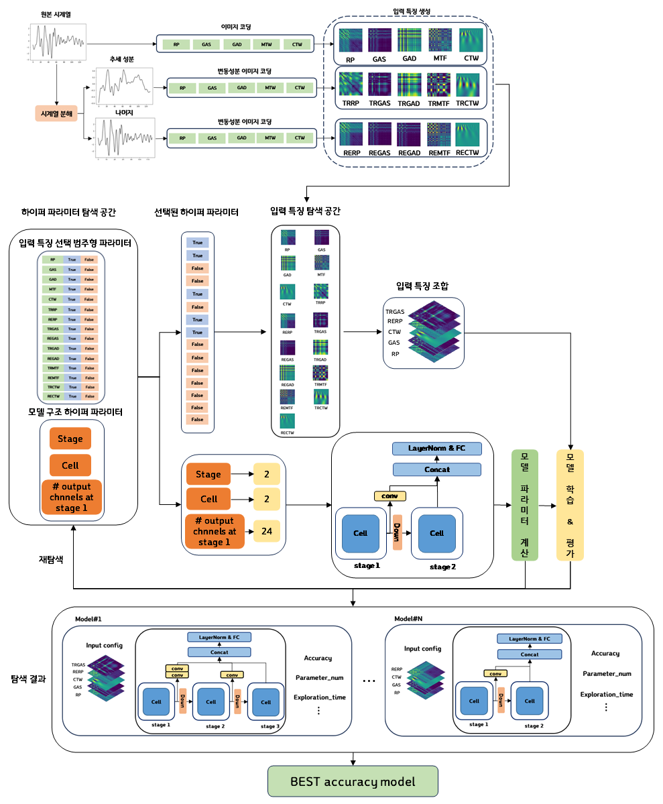
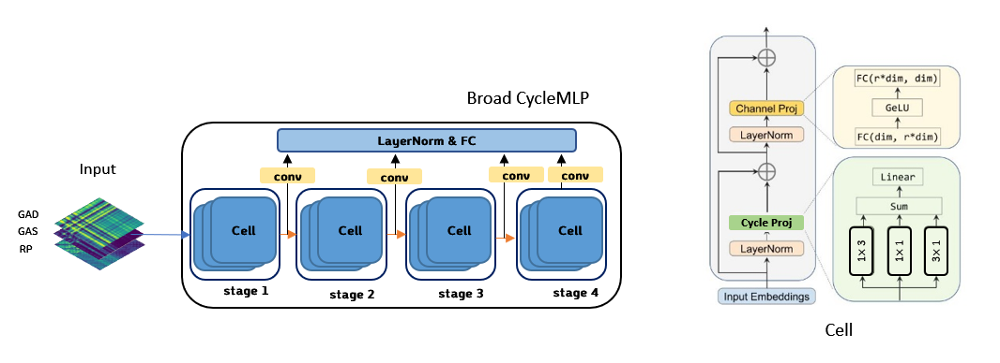
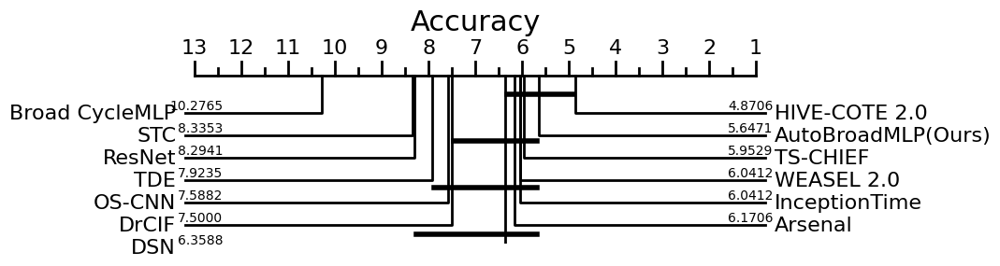

# Search for Light Weight Time Series Classification Deep Learning Models using Two-Dimensional Input Features and Automated Exploration

In this study, a method was proposed to find the optimal combination of input features and model architecture for each dataset. The proposed approach used various existing image encoding methods such as Recurrence Plot, Gramian Angular Summation Field, Gramian Angular Difference Field, Markov Transition Field, Continuous Wavelet, and time series decomposition using moving averages to create 13 input features. Additionally, a hyperparameter optimization framework was applied to automatically explore the combination of input features and model architecture for each dataset. The time series classification deep learning model with exploration applied is referred to as Broad CycleMLP. Applying the proposed method to Broad CycleMLP resulted in an average reduction of 68.76% in parameter usage and an average increase of 7.22% in classification accuracy across 85 UCR datasets.

## Broad CycleMLP architecture

Broad CycleMLP is a modified architecture that allows the output from each stage of the CycleMLP model to be incorporated into the final output. It has a repeating structure of cells for each stage, and as each stage is traversed, the dimensions of the feature maps double, while the size is reduced by half.
In the paper "Search for Light Weight Time Series Classification Deep Learning Models using Two-Dimensional Input Features and Automated Exploration," the original model architecture parameters were set as follows: 4 stages, 3 cells, and a dimension of 24 in the first stage.

## Results
We used the UCR 85 archive, which provides a diverse set of datasets collected in real-world environments for time series data classification. The UCR 85 archive is accessible below.
- UCR 85 Archive could be found [here](http://www.cs.ucr.edu/%7Eeamonn/time_series_data/)

We compared six ensemble-based methods and six deep learning-based methods. AutoBroad represents the results obtained by applying the proposed automation method to Broad CycleMLP.
- The classification accuracy for all methods can be found [here](https://github.com/CBNU-AILAB/Broad-Cycle/blob/main/accuracy_results/All_models_performance.csv)

